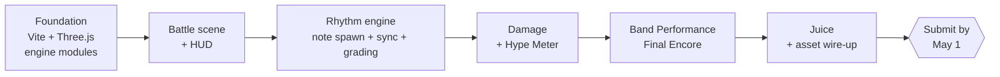

# Roadmap

Internal build plan for Justin (`jgericardo`) and Gideon (`gideonmarked`). Harmony Isles is entered in a vibe-coding hackathon — submission due **May 1, 2026**, requires ≥90% AI-generated code.

## Submission scope

A single playable Jam Clash with the Band Performance limit-break. No overworld, no shop, no save profiles, no encounter rolls. Press start → battle → win or lose → reload.

Quality bar is **hackathon, not production**: skip tests, skip CI, accept rough edges as long as the core loop is satisfying. Spend disproportionate time on juice (hit-pause, screen shake, particles, hit feedback) — judges feel these in 60 seconds.

## At a glance

## Time budget (~40 active hours combined across ~72h calendar)

| Block | Owner | Hours |
| --- | --- | --- |
| Foundation (Vite, Three.js iso renderer, EventBus, reducer, RNG, ConfigService, AudioManager) | Justin | 4–6 |
| Battle scene + turn queue + HUD | Justin | 3–4 |
| Rhythm engine (note spawn, AudioContext sync, hit grading, streak) | Justin + Gideon | 8–10 |
| Damage formula + Hype Meter + Band Performance limit-break | Justin + Gideon | 8–10 |
| Assets (sprites, song loop, SFX) + integration | Gideon | 6–8 |
| Juice (hit-pause, screen shake, particles, KO animation) | Gideon | 4 |
| Buffer / debugging / demo prep / submission | Both | 4–6 |

## In scope (must ship)

- One starter character vs. one enemy (placeholder or AI-generated sprites)
- Working rhythm minigame: note spawn, AudioContext sync, hit grading, streak counter
- Damage formula with multipliers, dodge, critical hits
- Hype Meter with fill animation
- Band Performance limit-break — Final Encore song, multi-lane phase
- Juice: hit-pause, screen shake, particle burst on crits, KO animation
- One song hardcoded, SFX library (hit-perfect, hit-good, miss, KO, victory)

## Out of scope (cut hard — no debate)

- Tests, Husky, GitHub Actions CI
- 9 other islands, 14 other characters, 6 other songs, all instruments and items
- Save profiles, shop, world map, encounter system, recruitment, personalities, chemistry, quests, tutorial, practice mode
- Asset manifest doc — Gideon organizes his own files
- Production polish — refactors, cleanup, doc generation

## Locked decisions (use design-doc defaults)

To eliminate decision drag, default every §34 open question to the doc's value. For the slice specifically:

- Active band size: **1v1**
- Mid-battle revive: **disabled**
- Loss penalty: **none** (battle resets)
- Permadeath: **off**
- Audio offset: **single hardcoded value** — calibration UI is post-hackathon

## Division of labor

- **Justin** — foundation, engine modules, battle/rhythm/damage/Hype systems, Band Performance code.
- **Gideon** — assets (sprites, song loop, SFX), juice (particles, screen shake, animation polish), demo prep and submission package.
- **Both** pair on rhythm engine and Band Performance tuning — "feel" benefits from a second set of eyes.

## Submission checklist

- [ ] `npm run dev` boots without errors
- [ ] Player can complete a full Jam Clash including a Band Performance
- [ ] Juice pass (hit-pause, screen shake, particles) applied
- [ ] Demo video recorded (60–90 seconds, shows full battle including limit-break)
- [ ] README has run instructions and AI-usage note (≥90% AI-generated, link to commit history / Claude logs as evidence)
- [ ] Repo state on `main` matches submission build
- [ ] Submission form filled and submitted before May 1 cutoff
