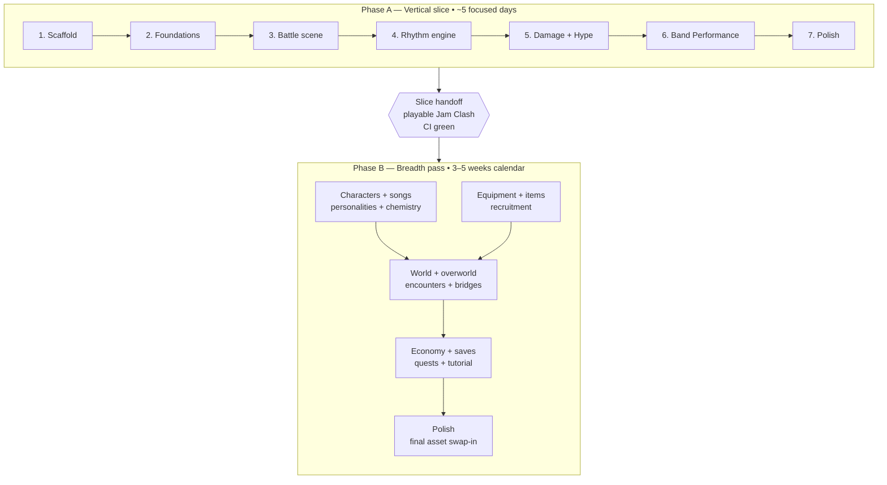
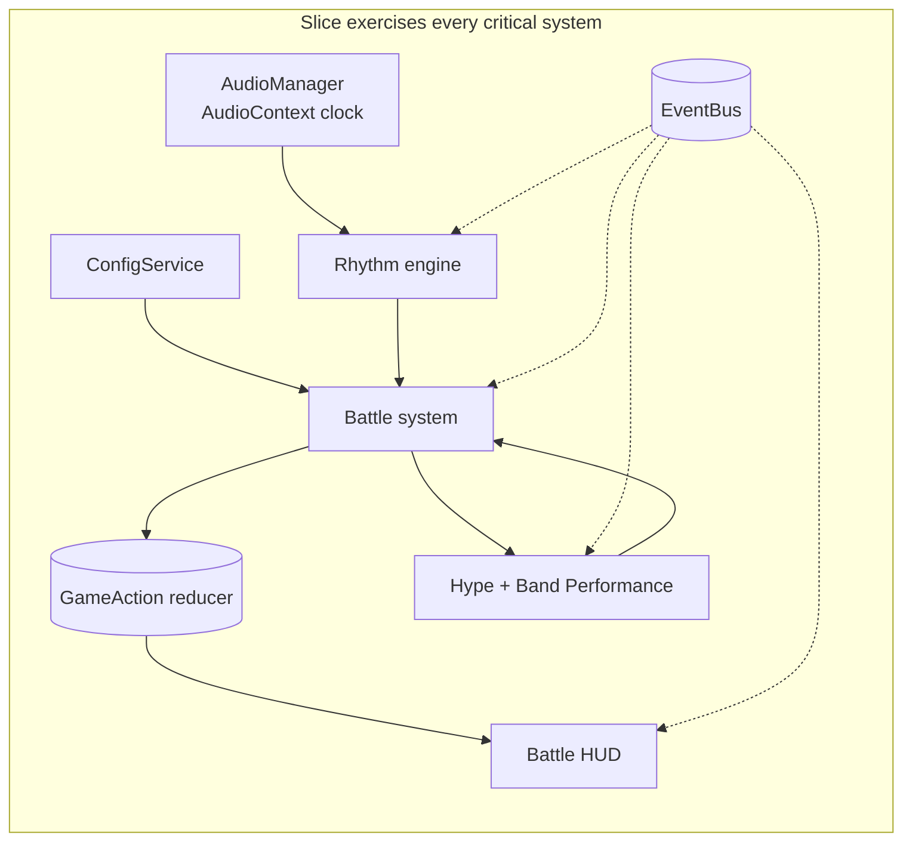

# Roadmap

Build plan for the Harmony Isles demo. Scope splits into a **vertical slice** (the hardest part of the game proven end-to-end) and a **breadth pass** that fills in content around it.

## Scope split

**Justin** builds systems and code. **Gideon** builds art, audio, and final content. Code lands with placeholder assets that load via the manifest system, so swap-in is a file replacement, not a code change.

## At a glance

## Phase A — Vertical slice (target: ~5 focused days)

A single playable Jam Clash that exercises every system the design doc calls "where the game lives or dies" (§33.2). No overworld, no shop, no save profiles, no encounter rolls. Press start → battle → win or lose → reload.

### Why 5 days, not 3

The slice's purpose is to de-risk the *hardest* systems end-to-end, not just the easy ones. The two most expensive parts are the rhythm engine (AudioContext sync, hit-window grading, drift across browsers) and the Band Performance limit-break (its own multi-lane minigame). Each takes ~1–1.5 days standalone; together with foundations, battle scaffolding, damage, Hype, and polish, the realistic envelope is 31–50 hours of focused work.

This estimate assumes Claude Max in the loop for boilerplate and pair-programming, plus hands-on testing between iterations. Without AI assistance, the same slice is ~2 weeks for a senior dev.

### Day-by-day shape (indicative)

| Day | Focus |
| --- | --- |
| 1 | Scaffold (Vite, Three.js, tooling, CI) + foundations (EventBus, reducer, RNG, ConfigService, AudioManager) |
| 2 | Battle scene (turn queue, action menu, HUD) + rhythm engine v1 |
| 3 | Rhythm tuning + damage formula + tests + Hype Meter |
| 4 | Band Performance limit-break (multi-lane phase runner, Final Encore) |
| 5 | Polish (hit-pause, screen shake, end-of-battle), asset manifest, README run docs, slice handoff |

### What's in
- 1 starter character vs. 1 enemy (placeholder sprites, 1v1)
- Full rhythm minigame (note spawn, `AudioContext` sync, hit grading, streak counter)
- Damage formula with multipliers, dodge, critical hits
- Hype Meter with fill animation
- Band Performance limit-break — Final Encore song
- Hit-pause, screen shake
- 1 song loop (placeholder), SFX library stub

### Checkpoints
1. **Scaffold** — Vite, Three.js orthographic-iso renderer, ESLint flat config, Prettier, Vitest, JSDoc + `tsconfig.json` with `checkJs`, Husky + lint-staged, GitHub Actions CI, `.gitignore`, pinned Node version.
2. **Foundations** — EventBus, GameAction reducer, seeded RNG, ConfigService loading JSON, AudioManager (Howler + AudioContext clock), I18n stub.
3. **Battle scene** — turn queue, action menu, placeholder character/enemy entities, HP/MP/Hype HUD.
4. **Rhythm engine** — note spawn timed off `AudioContext.currentTime`, hit windows (Perfect / Good / Miss), accuracy grading, streak counter. *(Critical path — the engine fails or wins here.)*
5. **Damage + Hype** — formula with all multipliers, Hype gain rules, fill animation, KO/victory states.
6. **Band Performance** — multi-lane runner phase, Final Encore song wired, flawless-bonus logic.
7. **Polish & wire-up** — hit-pause, screen shake, end-of-battle screen, asset manifest documenting every placeholder slot.

### Slice handoff criteria
- `npm run dev` boots without errors
- Player can complete a full Jam Clash including a Band Performance
- ESLint clean, all unit tests passing, CI green on `main`
- `docs/assets.md` lists every placeholder asset slot (path, format, dimensions)
- README updated with run/build/test commands

## Phase B — Breadth pass (target: 3–5 weeks calendar at ~2 sessions/week)

Once the slice is real, expand outward. Each system below is mechanical to add because the architecture already exists.

| Area | Adds |
| --- | --- |
| Characters | 14 remaining (4 starters + 10 recruitable), naming generator, 8 personalities |
| Songs | 6 remaining + per-character `notePatterns` |
| Equipment & items | All 25 instruments across 5 tiers, 5 consumables |
| World | 10 themed islands + 1 shop island, tilemaps, bridges, world map mode, placement UI |
| Overworld | Player movement, encounter system with pity floor, encounter telegraphs |
| Economy | Shop UI (4 tabs), weekly payouts, sell flow |
| Manager fantasy | 5 Manager Style archetypes, chemistry tracking, one scripted reveal |
| Recruitment | Join chance math, rarity tiers, recruitment UI |
| Meta | 3 save profiles, Manager Journal, 7 demo quests, tutorial flow, Practice Mode + audio offset calibration |
| Polish | Day/night cycle, particle systems, nine-slice UI frames, notification toasts |

Order is roughly: content (characters/songs/equipment/items) → world (islands/encounters) → economy/meta (shop/saves/quests/tutorial) → polish.

## What Gideon owns

Real assets to replace placeholders. The slice ships with programmer art so these are *not* blocking for Phase A, but the breadth pass needs them to feel like the game.

- **Sprites (Aseprite):** 15 character sheets (idle / 4-dir walk / battle attack / hit / KO), 25 instrument icons, enemy variants, UI frames, particle frames
- **Tilesets:** 10 island biomes (~per §6 of the design doc)
- **Audio:** 7 song loops (3-stem if Band Performance variants are needed), SFX library (hits, KO, level-up, UI, ambient per island)
- **Final art polish:** day/night lighting, neon/dusk variants

`docs/assets.md` (added during the slice) lists exact dimensions, atlas formats, and file paths so each asset has a clear destination.

## Decisions needed from Gideon

The design doc's §34 lists open questions. Phase A can defer most of them, but a few affect implementation choices once we leave the slice:

1. **Active band size in battle** — 3, 4, or 5? Affects HUD layout and turn-queue logic.
2. **Mid-battle revive** — keep Confidence Badge item as designed, or remove?
3. **Inter-battle Confidence retention** — 75% (doc default) or different?
4. **Loss penalty** — none (doc default) or some?
5. **Permadeath toggle** — post-demo or hard-mode option in demo?

Defaults from the doc are used unless Gideon overrides.

## Out of scope

Architecture is wired for these, but no content ships:

- Accessories (FX / Amp / Modifier slots)
- Artist Needs system
- Booking / Gig decisions
- Rival Managers and named bosses
- Story dialogue trees, romance arcs, faction reputation
- Multiplayer
- Procedural song generation
- Custom bridge positions
- Daily challenges
- Cloud saves (LocalStorage only)

## Risks

- **Audio sync drift** across browsers/devices. Mitigated by an in-game offset calibration sub-mode (planned in Phase B; the slice ships with a single hardcoded offset).
- **"Feel" tuning** — Phase A delivers a working rhythm engine with the doc's starting numbers. Refining hit windows, hit-pause, and Hype rates is iteration that lives outside this estimate.
- **Asset blockers** — if final art lands late, Phase B ships with placeholders flagged.
